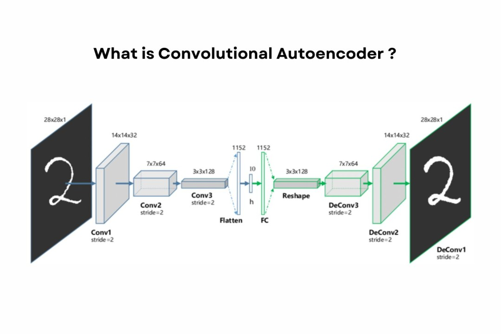

# Autoencoder Architectures Comparison 🔄🎨

A comprehensive comparison of three autoencoder architectures (Super Resolution AE, Convolutional AE, and Stacked AE) implemented in PyTorch for MNIST digit reconstruction. Includes latent space visualization with t-SNE and downstream classification using SVM achieving 98.78% accuracy.



## 📋 Description

This project implements and compares three different autoencoder architectures for unsupervised feature learning on the MNIST dataset. Each architecture demonstrates different approaches to dimensionality reduction and reconstruction, with comprehensive evaluation through reconstruction error analysis, latent space visualization, and downstream classification tasks.

The project showcases the power of learned representations through t-SNE visualizations and validates the quality of latent embeddings by training an SVM classifier that achieves near-perfect accuracy using only the compressed representations.

<br>
<div align="center">
  <a href="https://codeload.github.com/TendoPain18/autoencoder-architectures-comparison/legacy.zip/main">
    
  </a>
</div>

## 🎯 Project Objectives

1. **Implement Multiple Architectures**: Build three distinct autoencoder designs
2. **Compare Reconstruction Quality**: Evaluate MSE loss across architectures
3. **Visualize Latent Space**: Use t-SNE for 2D embedding visualization
4. **Validate Representations**: Train SVM classifier on learned embeddings
5. **Analyze Trade-offs**: Compare computational complexity vs performance

## ✨ Features

### Three Autoencoder Architectures

**1. Super Resolution Autoencoder (SR-AE)**
- Downsample input to 14×14 before encoding
- Upsample output back to 28×28 resolution
- Tests reconstruction from degraded input
- Useful for image enhancement tasks

**2. Convolutional Autoencoder (Conv-AE)**
- Convolutional layers preserve spatial structure
- Batch normalization for training stability
- Progressive downsampling/upsampling
- **Best performance**: Lowest reconstruction error

**3. Stacked Autoencoder (Stacked-AE)**
- Fully connected architecture
- Multi-layer deep network (784→512→256→128→64)
- Traditional dense autoencoder design
- No spatial information preservation

### Comprehensive Analysis
- **Training Loss Tracking**: Epoch-by-epoch loss comparison
- **Reconstruction Visualization**: Original vs reconstructed digit comparison
- **Latent Space Analysis**: t-SNE visualization with 200 samples (20 per class)
- **Downstream Classification**: SVM trained on latent representations
- **Quantitative Metrics**: MSE reconstruction error on test set

### GPU Acceleration
- Automatic CUDA detection and utilization
- Batch processing for efficient training
- Fast inference for visualization

## 🔬 Theoretical Background

### Autoencoder Architecture

**General Structure**:
```
Input (28×28) → Encoder → Latent Space (64-dim) → Decoder → Output (28×28)
```

**Objective**: Minimize reconstruction error
```
Loss = MSE(Input, Reconstruction) = (1/N) Σ ||x - x̂||²
```

### 1. Super Resolution Autoencoder

**Encoder Path**:
```
28×28×1 → Downsample (14×14×1) → Conv (14×14×32) → Conv (7×7×64) 
→ Flatten → Linear (256) → Latent (64)
```

**Decoder Path**:
```
Latent (64) → Linear (256) → Linear (7×7×64) → ConvT (14×14×32) 
→ ConvT (28×28×16) → Conv (28×28×1)
```

**Key Feature**: Forces model to recover lost information from downsampled input

### 2. Convolutional Autoencoder

**Encoder Path**:
```
28×28×1 → Conv+BN (14×14×32) → Conv+BN (7×7×64) → Conv+BN (7×7×128) 
→ Flatten → Linear (64)
```

**Decoder Path**:
```
Linear (64) → Unflatten (7×7×128) → Conv+BN (7×7×64) 
→ ConvT+BN (14×14×32) → ConvT (28×28×1)
```

**Key Feature**: Symmetrical encoder-decoder with batch normalization

### 3. Stacked Autoencoder

**Encoder Path**:
```
784 → Linear (512) → Linear (256) → Linear (128) → Linear (64)
```

**Decoder Path**:
```
64 → Linear (128) → Linear (256) → Linear (512) → Linear (784)
```

**Key Feature**: Pure fully connected architecture, no spatial awareness

### t-SNE Visualization

**t-Distributed Stochastic Neighbor Embedding**:
- Reduces 64-dimensional latent vectors to 2D for visualization
- Preserves local structure (similar digits cluster together)
- Reveals how well the model learned discriminative features

**Algorithm**:
```
High-dim similarities: p_ij ∝ exp(-||x_i - x_j||² / 2σ²)
Low-dim similarities: q_ij ∝ (1 + ||y_i - y_j||²)⁻¹
Minimize KL divergence: KL(P||Q) = Σ p_ij log(p_ij / q_ij)
```

## 📊 Performance Results

### Training Loss (5 Epochs)

| Architecture | Final Loss | Convergence Speed |
|--------------|------------|-------------------|
| Super Resolution AE | 0.008047 | Moderate |
| **Convolutional AE** | **0.002153** | **Fast** |
| Stacked AE | 0.015532 | Slow |

### Test Set Reconstruction Error

| Architecture | MSE Error | Rank |
|--------------|-----------|------|
| Super Resolution AE | 0.007407 | 2nd |
| **Convolutional AE** | **0.002096** | **🥇 1st** |
| Stacked AE | 0.014568 | 3rd |

**Winner**: Convolutional AE achieves **71.6% lower error** than Stacked AE

### Downstream Classification (SVM on Latent Space)

**Task**: Train linear SVM on 64-dimensional latent vectors

| Dataset | Samples | Accuracy |
|---------|---------|----------|
| Training | 60,000 | - |
| Testing | 10,000 | **98.78%** |

**Insight**: High accuracy proves the latent representations capture discriminative features for digit classification, despite being trained only for reconstruction.

## 🚀 Getting Started

### Prerequisites

**Python Requirements**:
```
Python 3.8+
PyTorch 1.9+
torchvision
NumPy
Matplotlib
Seaborn
scikit-learn
```

**Hardware**:
- CUDA-compatible GPU (recommended)
- 4GB+ RAM
- 1GB disk space for MNIST dataset

### Installation

1. **Clone the repository**
```bash
git clone https://github.com/yourusername/autoencoder-architectures-comparison.git
cd autoencoder-architectures-comparison
```

2. **Install dependencies**
```bash
pip install torch torchvision numpy matplotlib seaborn scikit-learn
```

3. **Verify GPU (optional)**
```bash
python -c "import torch; print(f'CUDA Available: {torch.cuda.is_available()}')"
```

4. **Run the notebook**
```bash
jupyter notebook autoencoder_comparison.ipynb
```

## 📖 Usage Guide

### Training an Autoencoder

```python
# Define architecture
model = ConvAE(latent_dim=64)

# Train
losses = train_autoencoder(
    model, 
    train_loader, 
    epochs=5, 
    lr=0.001
)

# Evaluate
test_error = calculate_reconstruction_error(model, test_loader)
print(f"Test MSE: {test_error:.6f}")
```

### Visualizing Reconstructions

```python
# Compare original vs reconstructed
visualize_reconstructions(model, test_dataset, n_samples=10)
```

### Extracting Latent Representations

```python
# Get latent vectors for entire dataset
latents = []
labels = []

model.eval()
with torch.no_grad():
    for data, label in data_loader:
        z = model.encode(data.to(device))
        latents.append(z.cpu().numpy())
        labels.append(label.numpy())

latents = np.vstack(latents)
labels = np.concatenate(labels)
```

### t-SNE Visualization

```python
from sklearn.manifold import TSNE

# Reduce to 2D
tsne = TSNE(n_components=2, random_state=42, perplexity=30)
latents_2d = tsne.fit_transform(latents)

# Plot
plt.scatter(latents_2d[:, 0], latents_2d[:, 1], c=labels, cmap='tab10')
plt.colorbar(label='Digit')
plt.title('Latent Space Visualization')
plt.show()
```

### Training SVM Classifier

```python
from sklearn.svm import SVC
from sklearn.metrics import accuracy_score

# Extract latent features
train_features = model.encode(train_data).cpu().numpy()
test_features = model.encode(test_data).cpu().numpy()

# Train SVM
svm = SVC(kernel='rbf', C=10, gamma='scale')
svm.fit(train_features, train_labels)

# Evaluate
predictions = svm.predict(test_features)
accuracy = accuracy_score(test_labels, predictions)
print(f"SVM Accuracy: {accuracy*100:.2f}%")
```

## 📈 Key Insights

### Why Convolutional AE Performs Best

1. **Spatial Structure**: Convolutions preserve 2D spatial relationships
2. **Parameter Efficiency**: Shared weights reduce overfitting risk
3. **Translation Invariance**: Learns robust features across image positions
4. **Batch Normalization**: Stabilizes training and improves convergence

### Architecture Comparison

**Convolutional AE**:
- ✅ Best reconstruction quality
- ✅ Preserves spatial information
- ✅ Fewer parameters than Stacked AE
- ❌ Slightly slower per epoch

**Stacked AE**:
- ✅ Simple architecture
- ✅ Fast forward pass
- ❌ Ignores spatial structure
- ❌ Highest reconstruction error

**Super Resolution AE**:
- ✅ Learns upsampling
- ✅ Useful for enhancement tasks
- ❌ Information loss from downsampling
- ❌ Moderate reconstruction error

### Latent Space Quality

**Good latent space characteristics**:
- Clear cluster separation in t-SNE plots
- Similar digits grouped together
- Smooth transitions between classes
- High SVM classification accuracy (98.78%)

## 💻 Model Parameters

| Architecture | Encoder Params | Decoder Params | Total Params |
|--------------|----------------|----------------|--------------|
| Super Resolution AE | ~363K | ~365K | ~728K |
| Convolutional AE | ~387K | ~387K | ~774K |
| Stacked AE | ~536K | ~536K | ~1.07M |

**Observation**: Convolutional AE achieves best performance with moderate parameter count.

## 🎓 Learning Outcomes

This project demonstrates:

1. **Unsupervised Learning**: Feature extraction without labels
2. **Dimensionality Reduction**: Compress 784-dim to 64-dim representations
3. **Autoencoder Variants**: Different architectural approaches
4. **Latent Space Analysis**: Visualizing learned representations
5. **Transfer Learning**: Using autoencoder features for classification
6. **PyTorch Implementation**: Custom models, training loops, and visualization
7. **GPU Programming**: CUDA acceleration for deep learning

## 🔍 Applications

**Autoencoders are used for**:
- **Anomaly Detection**: Identify outliers via reconstruction error
- **Denoising**: Remove noise from corrupted images
- **Dimensionality Reduction**: Alternative to PCA for visualization
- **Generative Modeling**: Basis for VAEs and GANs
- **Feature Learning**: Pre-training for downstream tasks
- **Image Compression**: Lossy compression with learned codecs

## 🤝 Contributing

Contributions are welcome! Potential improvements:

- Add Variational Autoencoder (VAE)
- Implement denoising autoencoder
- Try different latent dimensions
- Add more visualization techniques
- Experiment with different datasets

## 📄 License

This project is licensed under the MIT License - see the [LICENSE](LICENSE) file for details.

## 🙏 Acknowledgments

- PyTorch team for deep learning framework
- MNIST dataset creators
- scikit-learn for t-SNE and SVM implementations

<br>
<div align="center">
  <a href="https://codeload.github.com/TendoPain18/autoencoder-architectures-comparison/legacy.zip/main">
    
  </a>
</div>

## <!-- CONTACT -->
<!-- END CONTACT -->

## **Unlock the power of unsupervised representation learning! 🔄✨**
